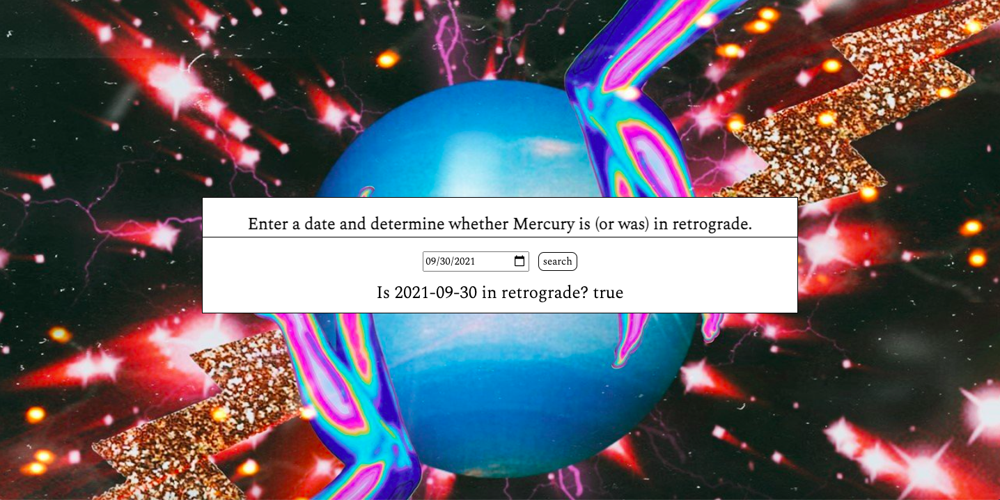

## Goal
Enable a user to enter a date - past, present, or future - and see if that date is within a mercury retrograde.

## How it's made
Made using HTML, CSS, Javascript, API and JSON. This is also a mobile, tablet, and desktop responsive.

## Lesson Learned
We use APIs for everything, so this was a relatively easy, fascinating, and super important thing to learn for me. 
